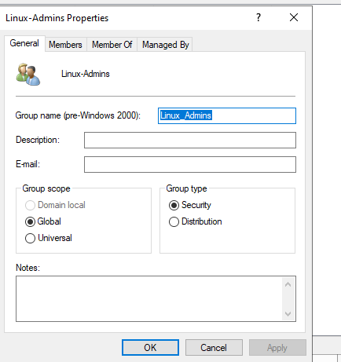
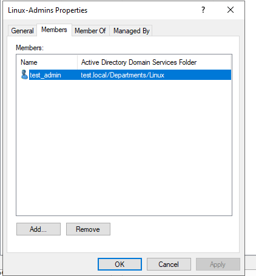
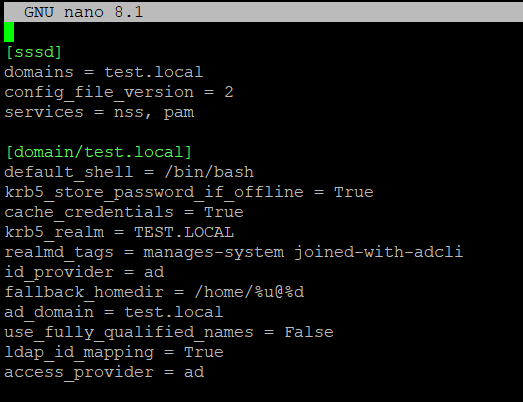
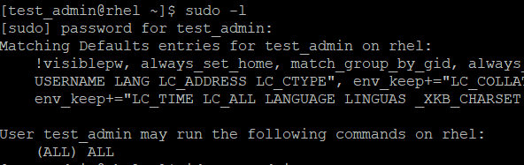

# Enterprise Linux Integration: Active Directory & RBAC with RHEL 10

This project demonstrates the integration of a **Red Hat Enterprise Linux (RHEL) 10** system into a **Windows Server 2022 Active Directory** domain. It focuses on implementing **Role-Based Access Control (RBAC)** by managing Linux `sudo` privileges through AD security groups.

## Overview

In modern hybrid environments, centralized identity management is crucial for security and scalability. This project eliminates "identity islands" by allowing Linux servers to consume identities directly from Active Directory using **SSSD** (System Security Services Daemon) and **Kerberos**.

### Key Features
* **Centralized Authentication:** Domain users can log in via SSH using AD credentials.
* **Active Directory RBAC:** Leveraging AD Security Groups to grant `sudo` permissions without local configuration changes.
* **Identity Mapping:** Automatic UID/GID mapping for AD objects.
* **Automated Provisioning:** Automatic creation of home directories for domain users upon their first login.

##  Tech Stack
* **OS:** RHEL 10
* **Domain Controller:** Windows Server 2022
* **Tools:** `realmd`, `sssd`, `adcli`, `samba-common-tools`
* **Protocols:** Kerberos, LDAP, SMB


##  Configuration Highlights

### 3. Windows Server 2022 Configuration
To enable **Role-Based Access Control (RBAC)** for our Linux environment, several steps were performed on the Windows Domain Controller.
#### 1. Active Directory Security Group Creation
A dedicated Security Group was created to manage administrative privileges across the Linux infrastructure. Centralizing this in AD allows us to grant or revoke sudo access without touching the Linux servers directly.

Tool: Active Directory Users and Computers (ADUC).

Group Name: Linux_Admins

Group Scope: Global

Group Type: Security



#### 2. User Assignment
To test the integration, a standard domain user was added to the Linux_Admins group. This user will automatically inherit sudo privileges on any Linux machine configured to recognize this group.

Action: Add member test_admin (or your username) to Linux_Admins.



### 2. SSSD Configuration
The **System Security Services Daemon (SSSD)** is the heart of this integration. It manages the connection between the RHEL 10 system and the Active Directory domain, handling authentication, caching, and identity mapping.
The configuration ensures that:

**Offline Authentication**: Users can log in even if the Domain Controller is temporarily unreachable (via cached credentials).

**Automatic ID Mapping**: SSSD automatically translates AD SIDs into Linux UIDs/GIDs without manual intervention.

**Configuration File**: `/etc/sssd/sssd.conf`
Below is the optimized configuration used for this project (sensitive data sanitized):

### /etc/sssd/sssd.conf

[sssd]
domains = your_domain.local
config_file_version = 2
services = nss, pam

[domain/your_domain.local]
default_shell = /bin/bash
krb5_store_password_if_offline = True
cache_credentials = True
krb5_realm = YOUR_DOMAIN.LOCAL
realmd_tags = manages-system joined-with-adcli
id_provider = ad
fallback_homedir = /home/%u@%d
ad_domain = your_domain.local
use_fully_qualified_names = False        #I changed this field to False just for skipping the domain side
ldap_id_mapping = True
access_provider = ad


[!IMPORTANT]
Key Parameters Explained:

ldap_id_mapping = True: Automatically generates Linux-compatible IDs from Active Directory.

use_fully_qualified_names = True: Ensures no name collisions by requiring the user@domain format.

access_provider = ad: Uses AD's native mechanisms to control who can log in.




### 3. Sudoers Integration
Instead of manual user management, a specific AD group (e.g., `Linux_Admins`) is mapped to the sudoers policy:
```bash
# Location: /etc/sudoers.d/ad_admins
"%Linux_Admins@yourdomain.local" ALL=(ALL) ALL
```
To check if we really get the sudoer rights we run ``sudo -l`` command:

### 4. Home Directory Automation
Enabled via authselect to ensure a consistent user experience:
```bash
sudo authselect enable-feature with-mkhomedir
```

